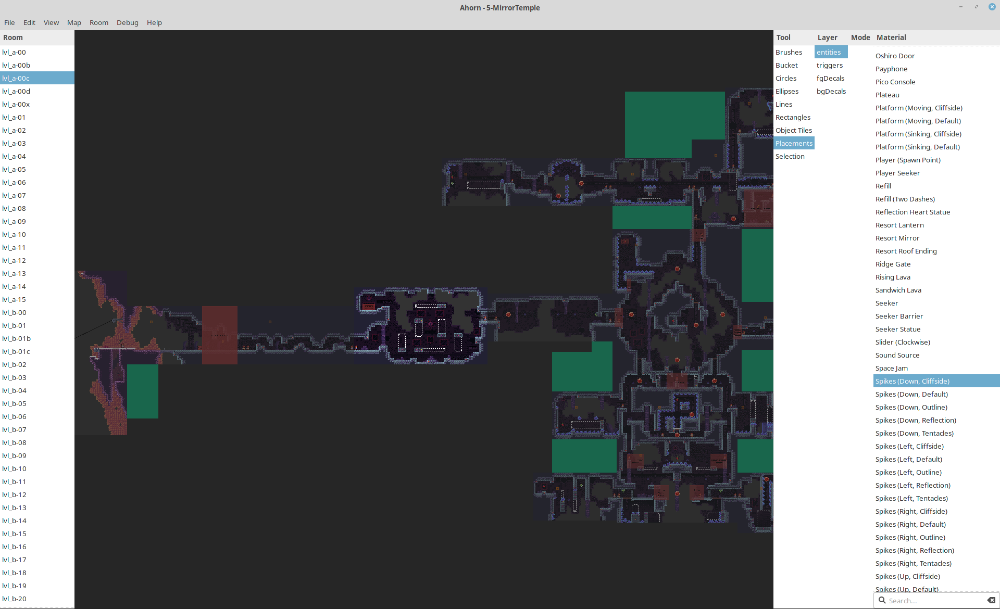
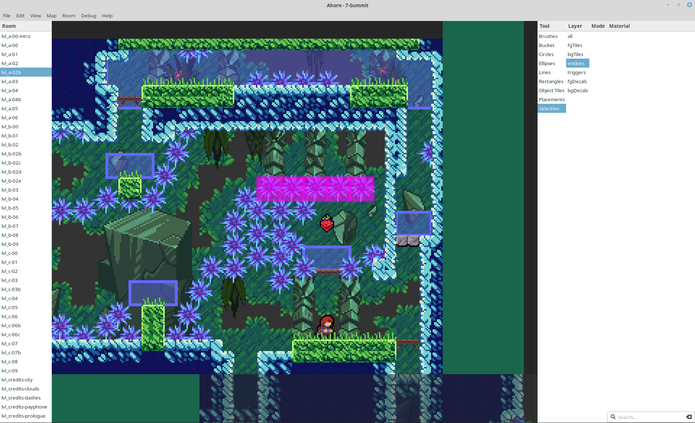

# Ahorn

[**Join us on Discord!**](https://discord.gg/Wtjf4Pb) (we're in `#map_making` on the "Mt. Celeste Climbing Association" Discord server)

Ahorn is a visual level maker and editor for the game Celeste. It allows editing map binaries, creating new ones, adding rooms, and filling the rooms with anything your heart desires (as long as what your heart desires is possible within the realms of the game). The generated map binaries can be loaded in the stock game or using [Everest](https://github.com/EverestAPI/Everest). For usage without Everest, you can replace a map in `Content/Maps` (remember backups), otherwise, you can place it in `ModContent/Maps` with Everest and use the custom chapter loading. Using Everest also enables other features like instantly reloading the map using F5 or teleporting to a certain room in the game by clicking on it in Ahorn.

The program is currently in an alpha state, many things are still missing and it is under active development. If you spot something that is missing, it will most likely be added some time in the near future. If you spot a bug or the program crashes, please report it.

Ahorn is based on [Maple](https://github.com/CelestialCartographers/Maple), a thin wrapper around the Celeste map binary format that allows you to generate maps using Julia.

This project is an unofficial map maker and level editor, it is merely a fan project aiming to aid map development until something official is available. None of this code is developed by or connected to the Celeste development team.

## Installation
First, [install Julia if you haven't already](https://julialang.org/downloads/). You need at least Julia 0.6.

The easiest way to install Ahorn would be to download [the installer `install_ahorn.jl`](https://raw.githubusercontent.com/CelestialCartographers/Ahorn/master/install_ahorn.jl) (Right-click the link and press "Save as...") and run it with Julia. Just follow its instructions. Ahorn and Maple are installed using Julia's `Pkg` system. The installer will also download and install required dependencies, so grab yourself a glass of juice while you wait.
```sh
~$ julia install_ahorn.jl
```
Upon launching the game for the first time, Ahorn will ask you to select the directory of your celeste installation. It needs Celeste to be installed to be able to extract textures from it, since we are not including them in the program.

The config file can be found in `~/.ahorn`.

Ahorn and Maple can be updated like any Julia package using `Pkg.update()`. To uninstall Ahorn, run `Pkg.rm("Ahorn")`, `Pkg.rm("Maple")` and then `Pkg.resolve()` in Julia.

## Usage
The possible actions in Ahorn are listed on the right, just select one to use it.
Hold right click to move around the map. Left click is your main way to place an object or select something. Tools like rectangle or line require holding left click while moving across the screen. Scroll to zoom.

Ahorn supports a couple of keybinds and special mouse functionality, with more to come. The following list might not be comprehensive.
 - q, w: shrink / grow width on selected
 - a, s: shrink / grow height on selected
 - arrow keys: move selected
 - left mouse button over selected: dragging selected
 - shift selecting keeps previous selection as well
 - holding ctrl + any of the above: use 1 as step size instead of 8 for more fine-grained placements
 - v, h: vertical / horizontal mirror of decal
 - delete: delete the given node / target
 - n: add node to target (after the targeted node / entity)
 - middle click: pick what's currently under the cursor in the selected layer
 - Ctrl + number key row 0-9: shortcuts to select tools
 - alt + arrow keys: move a room
 - alt + delete: delete room

 With Everest installed and Celeste running in debug mode, it supports some more:
 - ctrl + shift + leftclick on a room in Ahorn: teleport to that room in the game

If you are serious about making maps, it is highly recommended to use [Everest](https://github.com/EverestAPI/Everest) for the F5 (force map reload) and F6 (open map editor for the current map) features.

If you have any question, [**ask us on `#map_making` on Discord**](https://discord.gg/Wtjf4Pb) so we may add it to this README file. Thanks for being interested in making maps for Celeste!

## Some pictures

Ahorn's main window


Close-up of a room, with a row of Crystal Spinners selected


## Frequently Asked Questions

**When will I be able to place [entity/decal/other thing in celeste]?**

Whenever we add it. Celeste has a lot of things which support for has to be individually added. This takes time, so please be patient. However, if more people complain about the lack of a particular thing, we might add it sooner.

**Why do so many things in the program have weird names?**

Most of these are the names internally used by the game, so blame the devs. Most of them do not have any official names, but we might make the names in Ahorn a bit more descriptive later on.

**Something is broken!**

That's not a question, but please report any bug you find!

**What will you do once the official map maker is out?**

Whenever that happens, we might just continue like before; it might well be that the official editor will not be quite as powerful as Ahorn tries to be. We'll see.

**Why are you writing this in Julia?**

"because it just happend" ~ @Cruor

Because it's faster than most other languages, because it is a pleasure to write in, and because we wanted to.
